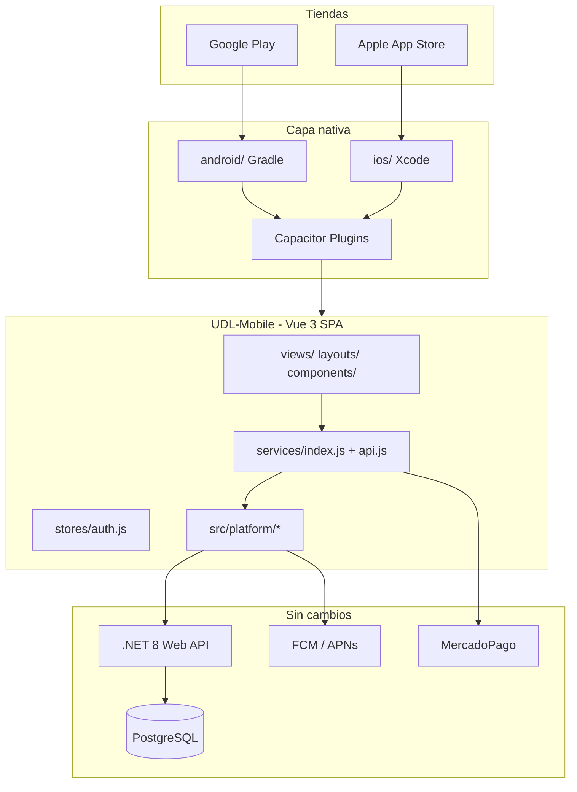

# Arquitectura — UDL Mobile

## Diagrama de capas



## Estructura de carpetas (completa)

```
C:\Users\juanc\OneDrive\Escritorio\UDL-Mobile\
├── android\                          # Proyecto Android Studio (Capacitor)
│   └── app\src\main\AndroidManifest.xml
├── ios\                              # Proyecto Xcode
│   └── App\App\Info.plist
├── dist\                             # Build Vite (webDir Capacitor)
├── docs\                             # Documentación de migración
├── public\
│   └── themes\                       # PrimeVue themes
├── scripts\
│   └── sync-from-web.ps1             # Sincronizar desde UDL-Frontend
├── capacitor.config.json
├── package.json
├── vite.config.js
├── index.html
├── .env.example
└── src\
    ├── platform\                     # Adaptadores móviles (NO copiar desde web)
    │   ├── index.js                  # initPlatform, StatusBar, back button
    │   ├── storage.js                # JWT Keychain/Keystore + Preferences
    │   ├── camera.js                 # @capacitor/camera
    │   ├── permissions.js
    │   ├── push.js                   # FCM/APNs → API
    │   └── mercadopago.js            # Browser + deep links
    ├── services\
    │   ├── api.js                    # Axios + JWT async (móvil)
    │   └── index.js                  # 100 % reutilizado del web
    ├── stores\
    │   └── auth.js                   # hydrate async + storage seguro
    ├── router\
    │   └── index.js                  # VITE_ENABLE_ADMIN flag
    ├── composables\
    │   ├── useTheme.js               # Web (localStorage)
    │   └── useAppStorage.js          # Carrito, preferencias móvil
    ├── layouts\
    ├── views\
    │   ├── auth\
    │   ├── socio\                    # MVP móvil prioritario
    │   └── admin\                    # Opcional (flag)
    ├── components\
    └── assets\
        ├── main.css
        └── mobile.css                # safe-area, tablas responsive
```

## Flujo JWT

1. Login → `authService.login` → API devuelve `token` + datos usuario
2. `authStore.setAuth` → `setToken()` en **Secure Storage** (nativo) / `localStorage` (dev web)
3. `api.js` interceptor → `await getToken()` en cada request
4. 401 → `clearAuthStorage()` + redirect `/login`

## Flujo de imágenes

1. `ImageUpload.vue` → `pickImage()` nativo o `<input file>` web
2. `FormData` → `POST /api/upload/image` (mismo endpoint que web)
3. URL relativa `/uploads/...` resuelta con `VITE_API_URL` en producción

## MercadoPago móvil

1. `initMercadoPago` devuelve `initPoint`
2. Nativo: `@capacitor/browser` abre checkout
3. Retorno: deep link `udlclub://callback?status=...`
4. `App.addListener('appUrlOpen')` cierra browser y actualiza estado

**Backend:** configurar `back_url` / `notification_url` con esquema `udlclub://` para builds móviles.

## Comparación web vs móvil (incremental)

| Entorno | URL dev | Almacenamiento token |
|---------|---------|----------------------|
| UDL-Frontend | `:5002` + proxy | localStorage |
| UDL-Mobile browser | `:5003` + proxy | localStorage (dev) |
| UDL-Mobile nativo | `VITE_API_URL` HTTPS | Keychain / Keystore |

Misma API, mismos servicios; solo cambia la capa `platform/` y variables de entorno.
